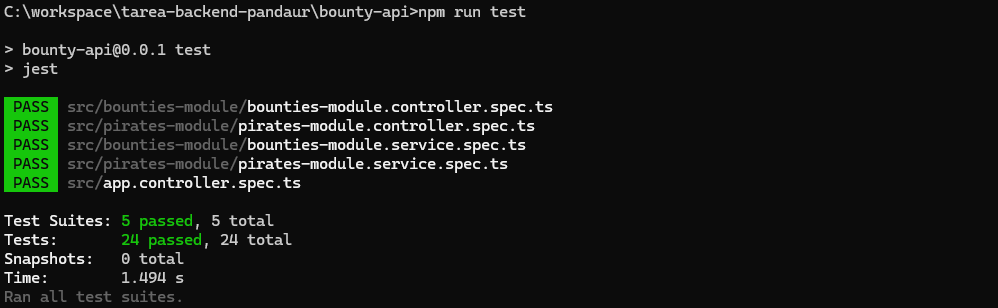

# Tarea Backend

## 1. Clonar el repositorio

Primero crear una carpeta en C:

C:\paolo_andaur_tarea2_backend

Abrir una terminal y moverse a esa carpeta:

cd C:\paolo_andaur_tarea2_backend

Luego clonar el repositorio: 

git clone https://github.com/andaurfiabane/bounty-api

---

## 2. Navegar al directorio del proyecto

cd C:\paolo_andaur_tarea2_backend\bounty-api

---

## 3. Instalar dependencias

npm install

---

## 4. Crear un archivo .env en la raíz del proyecto con el siguiente contenido

MONGO_URI=tu_url_mongodb

---

## 5. Iniciar el servidor

npm run start

---
## Evidencias de Pruebas Unitarias 

---
## Collection Pruebas POSTMAN

Puede utilizar el archivo adjunto dentro de este proyecto. El nombre del archivo es: "Collection Paolo Andaur Tarea 2.postman_collection.json" y se encuentra en el directorio raíz.